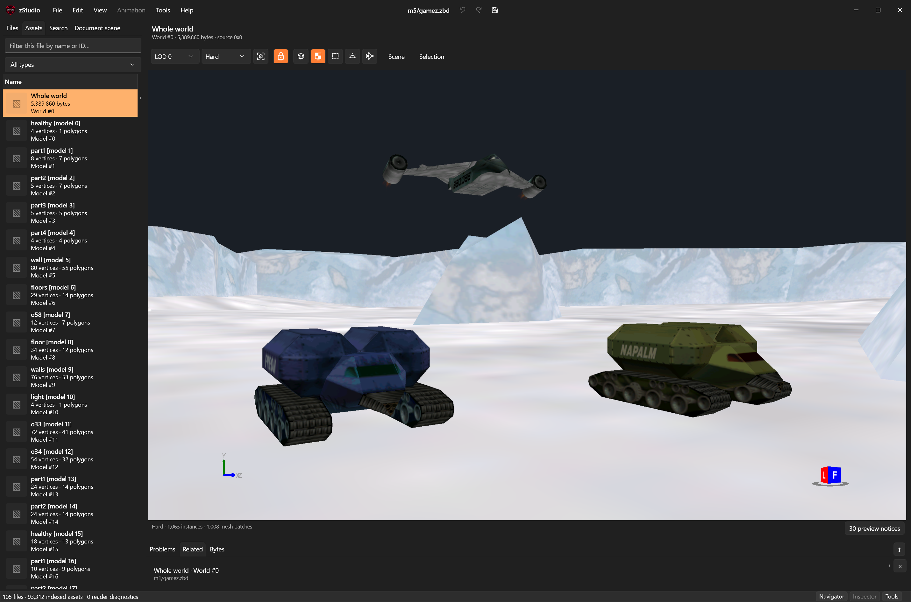

# zStudio

**Advanced viewer and editor for Zipper Interactive's ZBD files.**



zStudio is a native Windows desktop application built with C# 14, .NET 10, WPF Fluent and Direct3D 11. Browse game archives, inspect and export assets, preview assembled worlds, move mission pickups, and edit supported animation programs. This source tree targets **v0.5.0**.

[Download releases](https://github.com/Vorta/zStudio/releases) · [Report a bug or request a feature](https://github.com/Vorta/zStudio/issues/new/choose) · [Contribute](CONTRIBUTING.md) · [Changelog](CHANGELOG.md)

## Compatible games

| Game | Status |
| --- | --- |
| **Recoil** | Supported for the format versions tested in the 1998 and 1999 datasets. See the capabilities and limits below. |
| Other Zipper Interactive titles | Planned; compatibility has not yet been established. |

Game files are supplied by the user and are not included. Recognizing an archive does not imply that every editing operation is supported or that edited files have been verified in the original game.

The version-28 animation editor supports event and sequence editing, deterministic playback and seeking, preloaded audio, undo/redo and verified Save As. Its preview includes mission starting layouts, authored camera following, texture cycles, transparency, LOD selection and an adjustable-height ground grid for falling debris. The [pickup placement editor](docs/pickup-editor.md) adds selection, axis dragging, exact coordinates and verified archive saving in Whole world. Other formats provide browsing, inspection, previews and standard exports. See [the animation editor guide](docs/animation-editor.md) for controls and preview limitations.

## Run

Download the latest published `zStudio-<version>-win-x64.zip` from [GitHub Releases](https://github.com/Vorta/zStudio/releases), extract it, and run **zStudio.exe**. Keep the adjacent **dependencies** folder with it. Releases include a SHA-256 checksum. The self-contained Windows 11 x64 build does not require Python, Visual Studio, or a separate .NET installation. A Direct3D 11-capable graphics device is needed for 3D previews.

```text
zStudio.exe
dependencies/
```

The dependencies folder contains the application libraries, bundled .NET runtime, documentation, and license notices. The executable and app window use the supplied Studio icon.

The current development build also supports **local MCP access for AI agents**. Enable **Tools → MCP integration…**, copy the displayed configuration into your agent, and connect through `zStudio.exe --mcp`. Connecting and discovering tools stays in the background; the first workspace request opens or attaches to zStudio. Agents share the visible workspace and can browse, inspect, preview, edit, undo, export and save through the same protections as the GUI. See [MCP setup and tool guide](docs/mcp.md). This feature is unreleased; the published v0.4.8 package does not include it.

Choose **File → Open folder** and select the folder containing `image.zbd` and the mission directories, such as `zbd_1999`. Double-click a file in Files to open it and switch to Assets. Open files are marked in Files and have a close button. Filter assets on the left, or use the Search tab across the selected root. Folder scanning includes unknown files, which can be inspected as raw bytes.

## Configure MCP for Codex

MCP requires **zStudio v0.5.0 or later** and Codex running locally on Windows under the same Windows account as zStudio. Keep `zStudio.exe` and its `dependencies` folder together at a stable installation path.

1. Launch zStudio once, open **Tools → MCP integration…**, and check **Enable local MCP access**. Access is off by default. You can then close zStudio; the preference is retained.
2. Open your Codex user configuration, normally `%USERPROFILE%\.codex\config.toml` (for example, `C:\Users\YourName\.codex\config.toml`). If you use a custom `CODEX_HOME`, use its `config.toml` instead. Add the block below, replacing the executable path with your installation path. Update an existing `mcp_servers.zstudio` section rather than adding a duplicate.

   ```toml
   [mcp_servers.zstudio]
   command = 'D:\Tools\zStudio\zStudio.exe'
   args = ["--mcp"]
   enabled = true
   startup_timeout_sec = 60
   tool_timeout_sec = 120
   ```

   Single quotes in the TOML path preserve Windows backslashes. The **Copy configuration** button in zStudio provides generic MCP JSON; use the TOML form above for Codex's `config.toml`.

3. Restart Codex to load the configuration. If the Codex CLI is installed, run `codex mcp get zstudio` to check the executable path and arguments. This confirms configuration; the first workspace request below checks the actual connection.
4. Ask Codex: **“Use zStudio MCP to show the current workspace state.”** zStudio should open on this first workspace request, or attach to the already running instance of the configured installation. Then try: **“Open my ZBD root at D:\Games\Recoil\zbd, open m1/gamez.zbd in Whole world, and inspect its pickups without changing anything.”** Replace the root with your game-data folder.

As an alternative to adding the configuration block manually, register the server from PowerShell with the Codex CLI:

```powershell
codex mcp add zstudio -- 'D:\Tools\zStudio\zStudio.exe' --mcp
codex mcp get zstudio
```

You can then add the optional timeout values from the TOML example. Codex's supported configuration and CLI commands are documented in the [official MCP guide](https://developers.openai.com/codex/mcp).

Starting Codex and discovering tools leaves the zStudio window closed. Only a workspace request launches it. Agents work in the visible GUI, sharing document selections, edits, undo history and saves. Camera commands move the viewport without taking over your physical mouse. Closing Codex leaves zStudio open.

If a workspace call reports `access_disabled`, enable access in **Tools → MCP integration…** yourself. If you move or update the portable installation, check the configured executable path and restart the Codex connection. After **Disconnect clients**, restart the connection as well. If several instances of that installation are open, close the extra instances or use `args = ["--mcp", "--instance", "INSTANCE_ID"]` with the desired ID from the integration window; that ID is valid only for that running instance. To revoke access, uncheck **Enable local MCP access** in zStudio. See the [full MCP guide](docs/mcp.md) for tool coverage, drafts, save protections and connection details.

## Available tools

| Content | Browse and inspect | Export |
| --- | --- | --- |
| Texture packs | Thumbnails, enlarged preview, zoom/pan, channel views, pixel values, palettes and headers | PNG with alpha, JSON |
| Sound archives | Member list, PCM waveform, play/pause/stop, seeking, cue points | Original WAV/member bytes, JSON |
| ZRD data | Typed nested trees, values and raw float bits | Original bytes and JSON |
| Prepared scripts | Reconstructed script text and instruction data | Text and JSON |
| Animation/effects | Edit events, sequences, references and keyframes; scrub motion/effects/audio previews in isolation or mission context | Verified new ZBD with Save As; edited JSON |
| GameZ | Individual models, assembled static worlds, scene tree, materials, texture references and node properties | OBJ/MTL with PNG textures, JSON |
| Mission pickups | Select pickups in Whole world, show bounds, unlock XYZ arrows or enter coordinates, undo/redo; matching difficulties move together | Save coordinates to their owning ZBD archive; Save As; optional backups |

The workspace uses resizable navigation, preview and tool panes, with Properties in a separate window. The Navigator tabs are Files, Assets, Search and Document scene. Assets appears only while a file is open; Document scene appears only when the active file contains a scene hierarchy. Files marks open documents with a blue dot and bold filename, underlines the active document, adds an asterisk for unsaved changes, and provides a close button on each open file row. Double-click a file or press Enter to open it and switch to Assets; use Search for root-wide asset searches. Related references navigate to matching assets. Files changed externally get a reload banner. Settings retain theme, pane widths, window size, and recent roots.

Textures open at 1:1 (100%) with the scroll position reset. At 1:1, each texture pixel occupies one physical screen pixel, regardless of Windows display scaling. Texture controls: wheel to zoom, left- or middle-button drag to pan, Fit and 1:1, RGBA/RGB/individual channels. Drag the texture or the surrounding preview background when the image extends beyond the viewport; scrollbars remain available.

3D textures display their original colors without added scene lighting. Right-button drag orbits, middle-button drag pans (Shift + right-button drag also works), and the wheel zooms toward the surface under the pointer. Frame all resets the camera. Select a node in the view or Scene tree to inspect or isolate it. Wireframe, textures, bounds, fly mode, LOD choices, and texture variants are available. **LOD 0 · Highest detail** is the default. Higher numbers select lower-detail distance bands separately for each object; objects with fewer variants keep their last available level. A model belonging to an LOD group previews that group's selected variant. The animation toolbar has the same picker, also applied to its optional mission level. The camera-following horizon is optional in the preview; OBJ world exports include it.

Click **Fly camera** in a model or **Whole world** preview to capture the mouse and keyboard for freecam navigation. The cursor is hidden while flying; the highlighted button and viewer overlay show that freecam is active, together with the current speed.

| Freecam control | Action |
| --- | --- |
| **W / S** | Move forward/backward along the viewing direction, including its vertical angle. |
| **A / D** | Strafe left/right horizontally. |
| **Space / C** | Move up/down along the world's vertical axis. |
| **Move the mouse** | Look around without holding a mouse button. |
| **Mouse wheel** | Increase/decrease movement speed; scrolling alone does not move the camera. |
| **Escape** | Exit freecam and restore ordinary controls at the current camera position and direction. |

Movement starts and stops with the keys, keeps the same speed near and far from surfaces, and does not accelerate diagonally. Speed is retained when leaving and re-entering freecam until the loaded preview changes. Switching away from the application, losing capture, replacing or hiding the preview, or closing the window also releases input. The camera can pass through geometry. Freecam applies to model and Whole world previews; animation navigation is unchanged.

All 3D cameras stay upright relative to world +Y, with free horizontal rotation and vertical tilt limited to ±89°. Orbit preserves its target and Fly preserves its position when rotating. View-cube transitions, inertia and authored-camera previews also stay upright; saved animation camera data is unchanged. This does not add terrain collision or lock the camera's height. Depth clipping follows the geometry in view, independently of the small navigation clearance, so entering a map's bounds does not destroy depth precision or prevent close inspection.

The animation preview toolbar starts with **LOD**, difficulty and the **Frame** icon, followed by icon toggles for Map, Grid, Ground collision, Horizon, Effects and Follow camera. Enabled options use an accent-filled background; tooltips explain each icon and its current state. **Height** sits next to Grid and accepts −999 through 999 game units, including fractions. Positive values raise the animation and negative values lower it. Valid values apply as you type, preserving the playhead and prior playback state while recalculating contact and duration. Unfinished or invalid text keeps the last valid height; an intentional field boundary, Enter or Escape restores its display. Height is preview-only. Grid and collision are independently enabled by default: hiding the grid leaves collision active. The plane stays at preview-world Y=0, equivalent to authored Y=−Height. This is a preview plane, not mission-terrain or camera collision. Grid, Height and collision stay together in toolbar overflow.

Animation controls: select an asset and press **Space** to play/pause. Play/pause, stop and frame-step icons sit beside the seek bar, with a current/total frame readout. Finite preview duration is calculated automatically; looping and open-ended programs use a labeled, adjustable preview range. Speed, Replay preview, Mute and volume sit below the transport. **Settings** contains mission/root information, seed, conditions, activation points, preview range and support. Scene selection and root binding are in the toolbar’s **Scene** menu; presentation and audio controls are not duplicated in Settings. Right-click an event and choose **Properties…** to edit its typed fields in a separate window; add, duplicate, delete and reorder events or sequences. Runtime and reset/stop phases preview separately. Audio starts unmuted at 50% volume. **Ctrl+S** saves a new animation pack; **Ctrl+Z / Ctrl+Y** undo/redo edits. See [the animation editor guide and engine evidence](docs/animation-editor.md).

Shortcuts: **Ctrl+O** opens a folder, **Ctrl+E** exports selected records, **Ctrl+W** closes the active file, and **F5** reloads. **Escape** first exits active freecam or cancels an active pickup drag. Otherwise, **Escape** or **Tools → Cancel export or validation** cancels an active export or validation; the menu item is disabled without such an operation. Indexing runs to completion unless the root changes or the application closes. Export creates a new folder outside the source tree; existing exports and game files are not overwritten. A canceled export may leave completed files in that new folder.

The Windows 11 Fluent workspace places **Files / Assets / Search / Document scene** on the left, the preview and persistent transport in the center, and **Sequences / Settings / References** on the right for animations. **Properties** opens in one reusable, resizable window through an item’s context menu, **View → Properties…**, or **Alt+Enter**. It stays on the explicitly opened item while you browse, including other open files. Its title identifies the owning file and record. Sequences opens by default when entering the animation viewer; switching animations retains the selected right-hand tab. Right-click an entry, sequence or event in Sequences and choose Properties to inspect its stored fields without changing tabs. Properties is also available for assets, scene objects and selected Whole world pickups. Undo/Redo icons share the Properties breadcrumb row at the top right; there is no bottom button row. Accepted edits update the owning document and its undo history; closing the window keeps them, and saving writes them to disk. Ctrl+S in Properties saves its pinned document. Selecting Cleanup does not change the preview phase. Numeric/vector/keyframe inputs keep unfinished drafts, show validation inline and support Escape to restore the stored value. The current file name and Undo, Redo and Save icons form a centered group in the title bar. Save As and Export remain in File; Validate remains in Tools. Use **File → Open folder** or **Ctrl+O** to change the root.

The resizable bottom tools are **Dispatch**, **Event log**, **Problems**, **Runtime**, **Related** and **Bytes**. Dispatch is the observed timeline; Event log retains distinct dispatch occurrences and exposes its history limit. Problems separates file/operation, preview, resource and support diagnostics. Runtime shows current sequence states and preview context. Related contains name-based matches. Bytes identifies the selected original source record and its offset, distinct from edited Properties and live simulation data.

Use **View → Workspace preset** for Inspect, Edit, Debug or Focus preview, and **View → Density** for Compact or Comfortable controls. Pane splitters, Inspector groups and selected tabs are remembered. Narrow windows temporarily collapse panes; status-bar buttons reopen them. **View → Reset layout** restores pane and tab defaults: Files, Sequences and Dispatch for animations, or Files and Related for other viewers. The single title/menu row has full-height minimize, maximize/restore and close controls, with Windows system commands, caption dragging, resizing and the maximize/Snap hit region retained.

**Tools → Validate current file** checks the source file on disk, not pending edits, and adds findings to Problems. Opening another root clears file/operation diagnostics. See [the animation editor guide](docs/animation-editor.md) for detailed controls and preview limitations.

## Build and verify

Open `zStudio.slnx` in Visual Studio 2026 with the .NET desktop workload, and select `zStudio.Desktop` as the startup project. SDK and package versions are pinned.

```powershell
dotnet build zStudio.slnx -c Release
dotnet test --solution zStudio.slnx -c Release
./tools/publish.ps1
```

The solution separates binary readers/exporters (`zStudio.Core`), Direct3D preview (`zStudio.Rendering`), WPF/audio (`zStudio.Desktop`), tests, and verification runners. Project folders and files use `zStudio.*`; existing `Recoil.Zbd.*` assembly names and namespaces remain stable for runtime and resource compatibility. Normal builds and unit tests require no game files or Python. Optional corpus and GPU/audio checks use your own game data. See [architecture and format evidence](docs/architecture.md), [verification commands](docs/testing.md), and [current status](docs/status.md).

## Current limits

Animation version 28 supports editing existing entries and Save As to a new file. Mission pickups stored in `puppies*.zrd` resources support position editing from Whole world; see [the pickup editor guide](docs/pickup-editor.md). Vehicles, turrets, scenery, directly authored GameZ pickups, texture import/replace, and creation of whole animation entries remain outside the supported editing tools. Animation preview approximates physics, beams, lighting, fog, camera parameters, screen effects and audio; game callbacks are trace-only. LOD selection is manual; camera-distance fades are not simulated. Edited animation packs and pickup archives have not yet been tested in the original game. Missing textures are reported; unresolved animation texture cards stay hidden. Six 1999 missions reference some textures absent from their own packs.

Unknown versions remain available for raw inspection. The snapshot reader limits individual files to 512 MiB. JSON exports are intended for inspection and external tools; they are not the Python CLI repack schema. The portable build is unsigned and has not yet been checked on an independent clean Windows machine.

## Contributing and future development

Bug reports, feature requests and pull requests are welcome. Use the [issue forms](https://github.com/Vorta/zStudio/issues/new/choose), and read [CONTRIBUTING.md](CONTRIBUTING.md) before proposing code changes. Include the game/data version, zStudio version and asset record identity in reports. Please do not upload game archives or extracted game assets.

Future work includes additional Zipper Interactive games and broader content editing. A compatibility request should identify the game and format evidence; support remains unconfirmed until tested. [Release and maintenance instructions](docs/releasing.md) describe versioning, CI and repository protections.

The former Python unpacker/repacker is archived separately from this desktop repository. An optional Python utility remains for independent export checks; it is not needed to build or run zStudio.

## License

zStudio is licensed under the [MIT License](LICENSE), copyright © 2026 Vorta. Game content retains its original ownership. This project is independent of Zipper Interactive and is not an official game tool.

Game data is not included in releases. Dependency notices are in [THIRD-PARTY-NOTICES.md](THIRD-PARTY-NOTICES.md).
